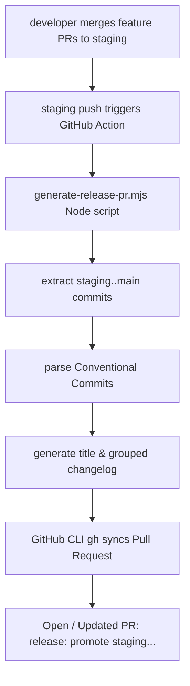

# Release Promotion Automation

This document outlines the automated workflow for promoting changes from the `staging` branch to the `main` (production) branch.

---

## 1. Context & Problem Statement

The Africa DevOps Summit website operates with two protected branches:

- `staging`: The target branch for all feature, fix, and content pull requests.
- `main`: The production branch deployed to Cloudflare Pages/cPanel.

To maintain consistency and high-quality logs, the repository enforces strict pull request title validation (`.github/workflows/pr-checks.yml`) following the **Conventional Commits** standard.

During release promotions (`staging` -> `main`), the default pull request title generated by GitHub is just `staging` or `Merge branch 'staging'`. This fails the semantic checks, causes unnecessary build failures in CI, and fails to document what changes are actually going to production.

---

## 2. Automated Solution Architecture

We have introduced a zero-dependency automated promotion solution composed of three parts:



### A. The Parsing Script: [generate-release-pr.mjs](file:///c:/Users/jlc254/Music/devopssummit.africa-v3/scripts/generate-release-pr.mjs)

A standalone Node.js ES script that:

- Identifies all commits that exist on `staging` but are not yet on `main`.
- Parses and validates Conventional Commit formats.
- Groups commits into human-readable categories: New Features, Bug Fixes, Content Updates, Security, Performance, and Maintenance.
- Automatically calculates a perfectly lint-compliant release title, e.g.:
  `release: promote staging to main for May 2026 release`
- Saves these outputs inside a `.release-temp/` directory for downstream tools.

### B. The GitHub Action Workflow: [promote-release.yml](file:///c:/Users/jlc254/Music/devopssummit.africa-v3/.github/workflows/promote-release.yml)

A fully automated GitHub workflow running on push to `staging` or manually triggered. It:

- Executes the generator script to compile changes.
- Uses the pre-installed **GitHub CLI (`gh`)** with `GITHUB_TOKEN` permissions to scan for existing promotion PRs.
- **Updates** the existing promotion PR's title and changelog description if one is already open.
- **Creates** a new promotion PR if none exists, pre-filled with the structured changelog, assigned to the release actor, and labeled `chore`.

### C. Validation Updates: [pr-checks.yml](file:///c:/Users/jlc254/Music/devopssummit.africa-v3/.github/workflows/pr-checks.yml)

- Added `release` as a first-class allowed Conventional Commit type.
- Updated the vague word list rule to include the `release` type to prevent vague release titles.

---

## 3. How to Use & Operate

### Local Testing (Dry Run)

You can run a safe, non-destructive test of the release generation locally on your current branch. This parses history and prints the proposed title/changelog to the console:

```bash
node scripts/generate-release-pr.mjs --dry-run
```

### Standard Promotion Cycle

1. Developers merge feature and fix PRs to `staging` as usual.
2. The `🚀 Release Promotion` workflow triggers automatically. It creates or refreshes the open PR from `staging` to `main`.
3. When the release manager is ready to deploy, they navigate to the PR on GitHub, verify the changes, and click **Merge**.
4. Once merged, `main` is updated, deploying changes to production, and `release-drafter` compiles the final published release notes.

---

## 4. Best Practices for Release Promotions

1. **Keep Commits Clean**: Ensure that feature branches follow Conventional Commits. The quality of the automated release notes depends on the commit subjects.
2. **Review the Auto-Generated PR**: The PR description includes a full markdown log and comparison links. Always check this before merging.
3. **Rollback Strategy**: Since staging and main remain highly synced, in the event of an issue, a rollback can be performed by reverting the promotion commit on `main`.
